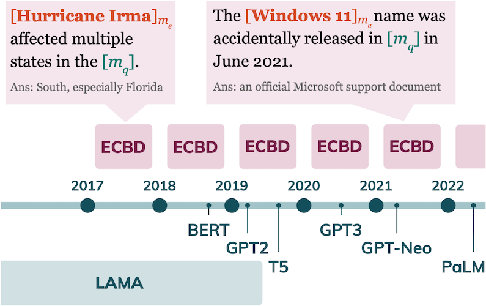
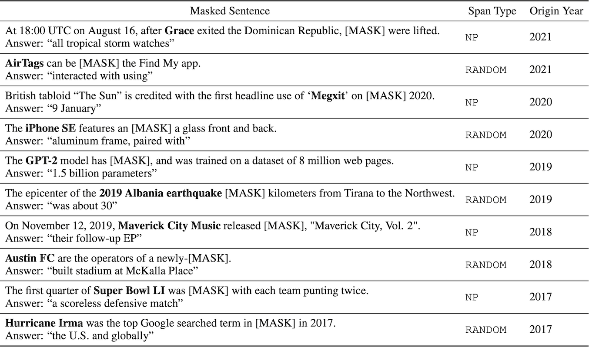

# Entity Cloze By Date: What LMs Know About Unseen Entities

This repository contains the data and code for the baseline described in the following paper:

> [**Entity Cloze By Date: What LMs Know About Unseen Entities**](https://arxiv.org/pdf/2205.02832.pdf) <br/>
> Yasumasa Onoe, Michael J.Q. Zhang, Eunsol Choi, Greg Durrett<br/>
> NAACL 2022 Findings (short)
```
@article{onoe2022ecbd,
  title={Entity Cloze By Date: What LMs Know About Unseen Entities},
  author={Onoe, Yasumasa and Zhang, Michael J.Q. and Choi, Eunsol and Durrett, Greg},
  journal={arXiv},
  year={2022}
}
```

## What's ECBD?

ECBD is a framework to analyze what LMs can infer about new entities that did not exist when the LMs were pretrained.  We collect entities indexed by the year when they were first introduced in English Wikipedia and their cloze sentences.




### Data Files
ECBD data files can be downloaded from [here](https://utexas.box.com/s/3s8p16ogtvkua91vx1d9mpwftrko81dq). `ecbd` contains 6 subsets (2017 to 2021 and popular). 

- `np_spans_dev.json`: Noun phrase spans for dev.
- `np_spans_test.json` Noun phrase spans for test.
- `random_spans_dev.json` Random spans for dev.
- `random_spans_test.json` Random spans for test.

The data files are formatted as jsonlines. Here is a single training example:
```
{
    "ex_id": "GPT-2_66045029_4_0", 
    "masked_sentence": "The GPT-2 model has <extra_id_0>, and was trained on a dataset of 8 million web pages.", 
    "answer_str": "<extra_id_0> 1.5 billion parameters <extra_id_1>", 
    "answer_d": {"<extra_id_0>": "1.5 billion parameters"}, 
    "span_type": "NP-COMMON", 
    "definition": ["[ENT_START]Generative Pre-trained Transformer 2[ENT_END] ([ENT_START]GPT-2[ENT_END]) is an open-source artificial intelligence created by OpenAI in February 2019.", "GPT-2 translates text, answers questions, summarizes passages, and generates text output on a level that, while sometimes indistinguishable from that of humans, can become repetitive or nonsensical when generating long passages.", "It is a general-purpose learner; it was not specifically trained to do any of these tasks, and its ability to perform them is an extension of its general ability to accurately synthesize the next item in an arbitrary sequence.", "GPT-2 was created as a \"direct scale-up\" of OpenAI's 2018 GPT model, with a ten-fold increase in both its parameter count and the size of its training dataset."], 
    "year": "2019", 
    "entity_span_str": "GPT-2", 
    "entity_span_loc": [1, 2]
}
```

| Field                     | Description                                                                              |
|---------------------------|------------------------------------------------------------------------------------------|
| `ex_id`                   | Example ID. Pattern: {EN Wiki title}\_{EN Wiki pageid}\_{paragraph num}\_{sentence num}  |                                                                              |
| `masked_sentence`         | Masked sentence.                                                                         |
| `answer_str`              | Target sequence formatted for T5.                                                        |
| `answer_d`                | Gold span.                                                                               |
| `span_type`               | Span type that can be noun phrase or random. NP can be common or proper.                 |
| `definition`              | Sentences from the first paragraph of the entity's article.                              |
| `year`                    | Origination date of the entity.                                                          |
| `entity_span_str`         | Entity mention span.                                                                     |
| `entity_span_loc`         | Location of the entity mention span.                                                     |


### Examples



## Getting Started 

### Dependencies

```bash
$ git clone https://github.com/yasumasaonoe/ecbd.git
```

This code has been tested with Python 3.8 and the following dependencies:

- `torch==1.7.1`
- `transformers==4.10.3`
- `datasets==1.12.1`
- `scikit-learn==1.0.1`
- `spacy==3.1.3`
- `wptools==0.4.17`

See `requirements.txt` for more information.

If you're using a conda environment, please use the following commands:

```bash
$ conda create -n ecbd python=3.8
$ conda activate ecbd
$ pip install  [package name]
```

## Data Construction

See [this README](data_construction/README.md) 

## Evaluation

See [this README](evaluation/README.md) 

## Contact 

Please contact at `yasumasa@utexas.edu` if you have any questions.
